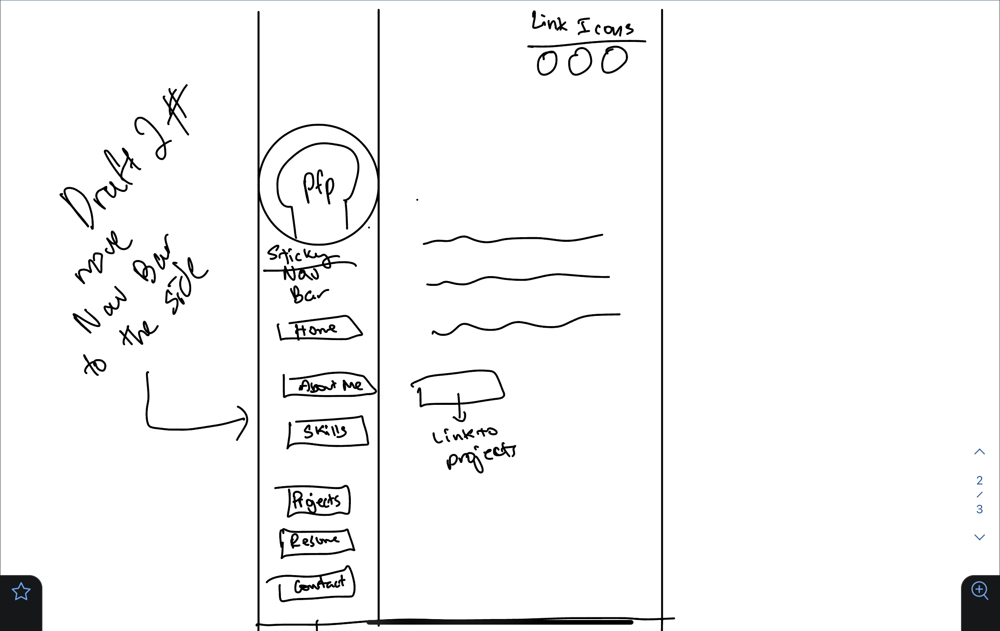
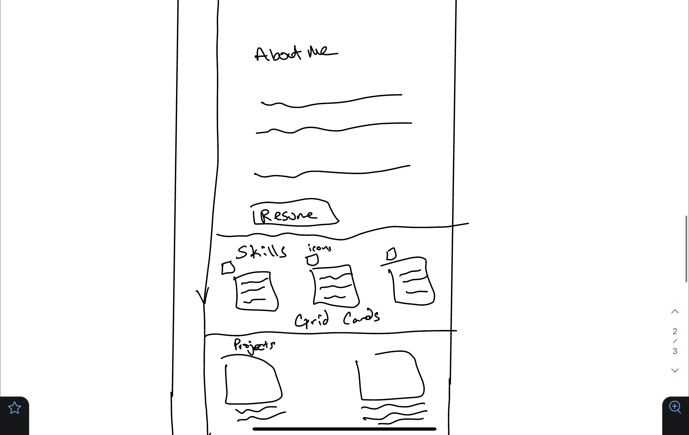
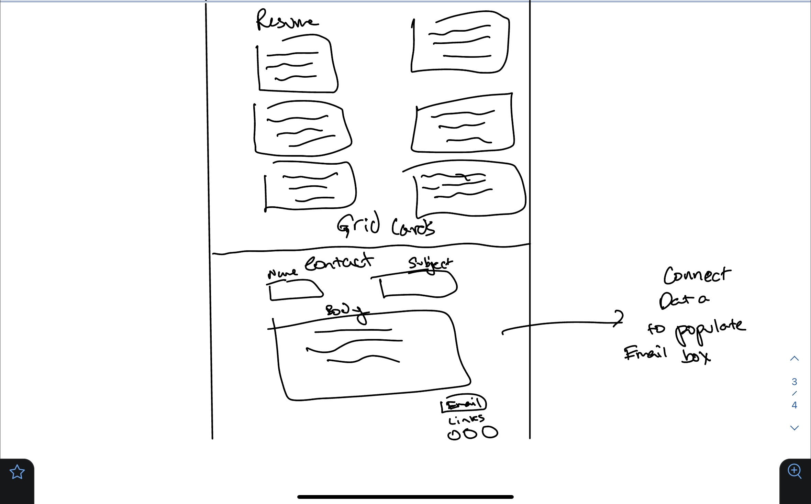
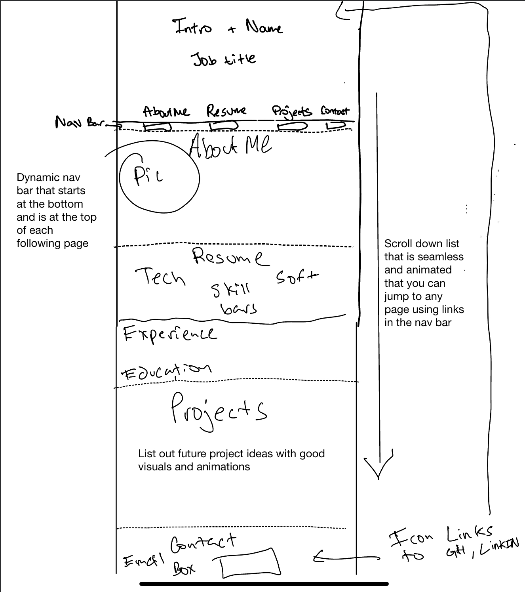

# E-Portfolio
Professional Work Portfolio 

**Screenshot of app**

**Technologies used:**

- Github/Github Pages
- VS Code
- Bootstrap 5 with external CSS and JS files
- Line Awesome Icon Packs with external CSS and JS files
- Mac Terminal
- Mac OS

**Install instructions:**

Just visit site: [E-Portfolio Site](https://omer-abdul-hameed.github.io/E-Portfolio/)

**User Stories:**

As a hiring manager, I want to view a website that presents resumes, mission statements/stories, experiences, and information about the page owner in an impressive format. This will make me more inclined to consider hiring this individual.

As a senior-level software engineer, I would like easy access to readable HTML, CSS, and JS files to assess coding proficiency and level for hiring and referral purposes.

As the user, I want to showcase my skills and personality on a webpage for everyone to see. I want to effectively market myself to potential hiring managers and colleagues who may provide or seek referrals in the future.

**Wireframes**

**Some problems and hurdles I faced were:**

- Coding an animate on scroll functionality
- Coding a mouseover and mouseout event listeners that only work for page width of 992 or more
- Coded in CSS originally but decided to use Bootstrap for CSS grid-ing
- Coded in HTML and used flex and grid classes to organize cards of info on each page
- Added CSS hover and hover after transitions for certain links
- Used Bootstrap to link pages to each other with certain div containers using classes that begin with #
- Could not get the html inputs on the contact page to populate to an external email app
- Could not get mobile to have a special event listener on the nav bar
- Could not optimize original resume tab, had to redo it and link the resume separately.

**Future Plans:**

- Plan to add more to the about me page, with carousel and cool modals.
- Plan to optimize better for mobile with more interactivity
- Have more functionality with the contact me page
- Make mobile nav bar more stylized and interactive
- Add sound animations when certain items are clicked